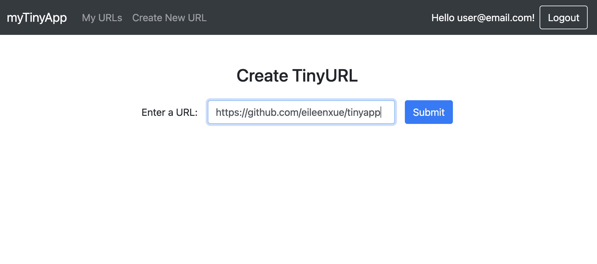
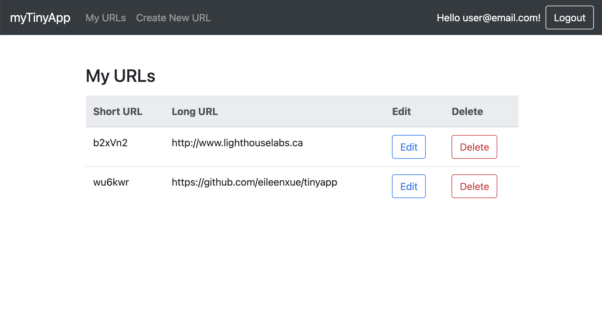
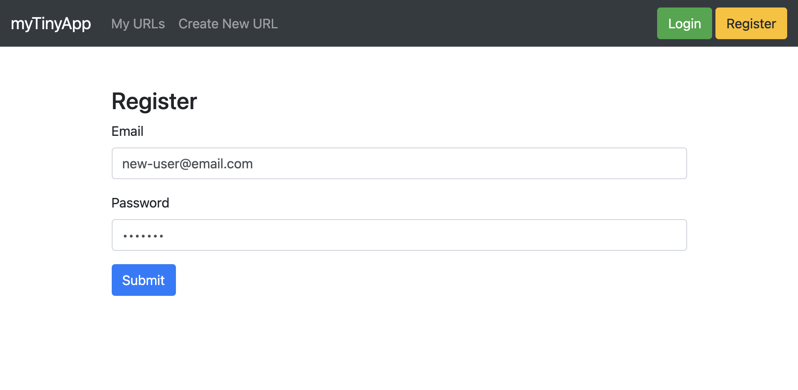
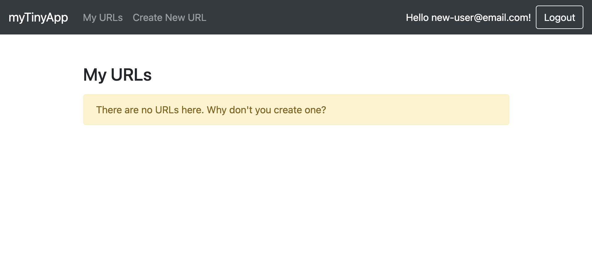

# TinyApp Project

TinyApp is a full stack web application built with Node and Express that allows users to shorten long URLs (à la bit.ly). This version was created by Eileen Xue to fulfill the requirements for Lighthouse Lab's Web Development Bootcamp.

## Final Product

1. To create a new short URL link, simply add your long URL into the creation form.

2. Display all the URLs in a list with options to edit the URL or delete it completely!

3. You can register for your own account to try the functionalities.

4. When you're a new user or don't have anymore URLs in your account, a helpful message will prompt you to start making some short links!

## Dependencies

- Node.js
- Express
- EJS
- bcrypt
- body-parser
- cookie-session

## Getting Started

- Clone the project using `git clone git@github.com:eileenxue/tinyapp.git`
- Install all dependencies (using the `npm install` command)
- Run the development web server using the `node express_server.js` command

## Note
Due to the limitations of this assignment, the generated short links are not stored in a database and will not work once the session is over.